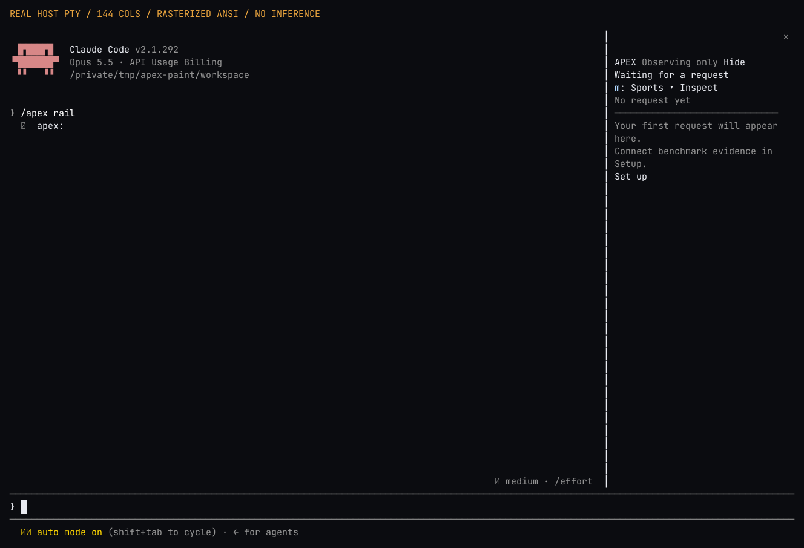
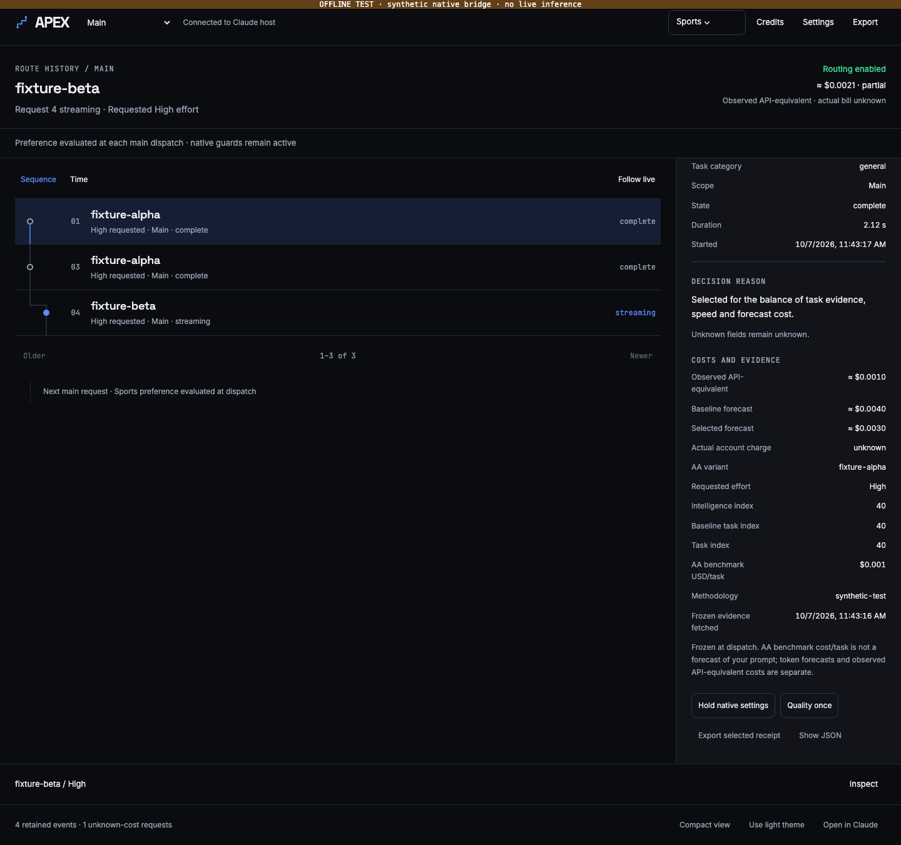

# APEX

**APEX by Kavren Labs**

[](https://github.com/AdamNsouli/apex/actions/workflows/verify.yml)

**A native Claude Code mod that changes the model and effort on the next unsent main request, with a live timeline and evidence-backed routing.**

APEX is executable middleware, not just instructions to Claude. It wraps the official `turn.step` hook and forwards the selected model and effort while preserving the streamed response and conversation. Eco, Balanced, High Quality and Sports can be selected while work is running.

**0.3.0-beta.1:** premium native rail and route workspace. Native hook tests, local browser integration and genuine terminal rendering checks pass. Live Anthropic inference, authenticated Artificial Analysis data ingestion and account billing have not been verified. There is no claim of guaranteed optimal routing or guaranteed bill savings.

## Tell Claude to install it

Copy this into **Claude Code**:

> Install APEX from the GitHub repository AdamNsouli/apex. Read its README and INSTALL.md first. Check that Claude Code is at least 2.1.292 and Node.js is at least 22; explain any prerequisite update before changing my installation. Add the apex-tools marketplace from AdamNsouli/apex and install apex@apex-tools at user scope. Reload plugins using the supported command or explain if a restart is needed, then open /apex rail and run /apex doctor. Help me connect my own Artificial Analysis API key using the local dashboard, and confirm the models my account permits and their exact benchmark/effort mappings. Do not read or copy my Claude login credentials, buy credits, change account billing, or run paid inference as an installation test. Report which checks succeeded and any remaining setup.

Or run:

```sh
claude plugin marketplace add AdamNsouli/apex
claude plugin install apex@apex-tools --scope user
```

Then reload plugins or restart Claude Code. The terminal prompt dock appears automatically. Open `/apex rail` for the compact native rail and `/apex dashboard` for the optional browser console. **A bare name is not globally resolvable: include `AdamNsouli/apex` when asking Claude to install.** No npm install is needed to use the plugin.

See [INSTALL.md](INSTALL.md) for the complete setup and removal instructions.

## What it does

- Routes actual main requests through the official model/effort hook; does not rewrite your transcript or replay tools.
- Shows request and tool activity, original settings, APEX-requested settings, response-reported model, revision, selection reason, and token-cost receipts. Requested effort is shown explicitly; effective provider effort stays unknown.
- Accepts live mode changes through native buttons, slash commands or an authenticated loopback dashboard. An already streaming request stays on its existing settings; acknowledged changes apply to the next unsent request.
- Discovers model IDs, efforts and capabilities from Anthropic's Models API; gets indices, prices, benchmark USD/task and performance from **your own Artificial Analysis key**. No generation-specific list or copied public benchmark dataset is bundled.
- Compares general intelligence, coding, agentic coding and six domain indices. A local deterministic classifier selects a broad task category; it does not send your prompt to a separate classifier model. Math uses the general intelligence index as a proxy.
- Keeps the native model when access, identity mapping, effort, capabilities, context size, freshness or baseline evidence is unknown. New model discovery does not silently grant account access.
- Respects user model/effort overrides through manual hold. Subagent requests keep their own settings in this release.
- Requires explicit APEX consent before changing requests on a confirmed direct-API backend. Consent is reset when a session starts or clears. Estimated reservations and unknown-cost liabilities protect APEX's routing budget; native requests are not stopped when that budget is exhausted.

## Live modes

| Mode         | Quality / cost / speed weights | Evidence floor                                         |
| ------------ | ------------------------------ | ------------------------------------------------------ |
| Eco          | 30% / 55% / 15%                | upper half of the eligible cohort                      |
| Balanced     | 55% / 25% / 20%                | upper quarter                                          |
| High Quality | 80% / 10% / 10%                | strongest comparable task score, including ties        |
| Sports       | 35% / 5% / 60%                 | upper half and within 3% of the highest raw task index |

These are transparent heuristics, not measured task-success probabilities. Hard, risky, ambiguous or repeatedly failing tasks retain at least the native baseline score and effort. Standard tasks also retain a baseline percentile floor; a quality downgrade needs conservative cost payback. If cost or latency is missing, that dimension is removed for every candidate in the comparison.

## Interface

`/apex rail` opens the **compact native rail**: current pair, last three main requests, one mode selector and Inspect. It requests 34 body columns; Claude chooses docking, inline placement and height. A wide terminal places it beside the conversation. A narrow terminal places it above the composer. Hide it and reopen with `/apex`; no browser is required.



This is actual Claude Code 2.1.292 ANSI output converted to an image, with local font rendering. No inference or real benchmark data is shown. [Narrow terminal](docs/screenshots/native-terminal-inline.png) · [Acknowledged pending mode](docs/screenshots/native-terminal-inline-pending.png).

The **prompt strip** is the two-row fallback. Its expanded, compact or hidden preference is saved locally. It yields to native surveys, preserves other mods, and suppresses duplicate controls while the rail is docked. Focus it with Claude's `ctrl+x tab`; `m` opens modes and `i` opens the rail. The mode chooser uses `e`, `b`, `q`, `s` while its site has focus. Host fonts, button chrome, scrolling and focus remain native. Desktop panes have harness coverage; live desktop rendering is unverified.

**Inspect** puts history, the selected receipt and its frozen evidence together. Selection stays on the historical request until you choose Follow live. Settings, consent and catalogue comparisons open contextually. Main and observed agent scopes remain distinct; agents retain native settings.

The optional **browser workspace** has one command bar, stepped request history and a narrow inspector. A step means an actual outgoing model/effort change. Tool markers mean recorded tool activity. Time view plots only known start/completion timestamps. Complete retained history is paginated, not silently hidden; theme and compact-view preferences persist locally.



[Compact workspace](docs/screenshots/dashboard-compact.png) · [Evidence setup](docs/screenshots/model-evidence.png) · [Mobile light theme](docs/screenshots/dashboard-mobile-light.png). Browser pictures use synthetic fixtures, not measured model results. [Native interface contract](docs/Native_Interface.md) · [UI specification](docs/UI_Specification.md) · [Assets and licenses](docs/Asset_Inventory.md).

**Quality once** arms High Quality for the next main dispatch, then returns to your base mode. It does not replay a request or bypass safeguards. Agents cannot consume it. Cancellation is explicit; restart or clear cancels the arm. If a guard holds native settings, the arm is still consumed and the receipt records why.

## Credits and costs

**Credits → Allow within estimate budget** grants APEX routing consent within an API-equivalent estimate budget. It does not activate Claude account extra usage or buy credits. The dialog provides the native `/usage-credits` command to manage account billing yourself. Actual billed charges and subscription entitlement remain **unknown**.

AA's benchmark `cost_per_task` is displayed separately from the forecast for your request. Token prices and benchmark latency do not guarantee your provider's price, cache behavior or response time. Unknown cache prices produce unknown observed costs; APEX retains the request's reservation instead of treating that charge as zero. The budget limits APEX's routing decisions, not all Claude spending.

## Data, privacy and limitations

Artificial Analysis publishes broad task indices, not a forecast of success on every individual prompt. Exact model-version and effort mappings need verification when identifiers differ. The dashboard supports that confirmation. Model access is also confirmed by you: the API list alone does not establish subscription access.

Catalogues refresh at most once per day while the session is open. Partial refreshes retain the prior snapshot. After 72 hours, automatic quality downgrades stop; after seven days, switching stops. Closed sessions do not run a background monitoring service.

Your AA key is held in local companion memory or supplied via `APEX_AA_API_KEY`. Native login authorization uses Claude's opaque handle only for first-party model discovery. APEX does not export the login token. Native local store holds routing preferences, the dock display preference and normalized benchmark cache. Receipts are session-only, capped at 1,000 events; export before closing. No transcript, tool arguments, paths or private reasoning are kept in receipts. Your normal Claude provider still receives the normal conversation.

This public repository contains code and synthetic fixtures, not an AA dataset. Use a key and license appropriate to your use. A hosted/shared redistribution service needs its own authorization from AA.

## Development and verification

```sh
npm run check
npm test
claude plugin validate plugins/apex
claude plugin validate .
npm run test:native
```

Browser testing additionally needs the development-only Playwright package and its Chromium binary:

```sh
npm install --no-save playwright@1.62.1
npx playwright install chromium
npm run test:browser
```

The installed plugin has no package dependencies. See [Verification_And_Limits.md](docs/Verification_And_Limits.md), [Architecture.md](docs/Architecture.md), [Routing_Policy.md](docs/Routing_Policy.md), and [SECURITY.md](SECURITY.md).

MIT license covers APEX code and original assets. Bundled fonts and the Archivo-derived publisher glyph retain their SIL Open Font License notices in the asset inventory. External services and data keep their own terms. APEX is an independent project, not an Anthropic or Artificial Analysis product.
